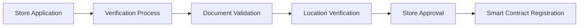
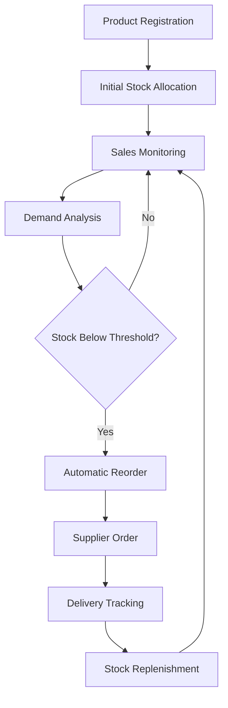

# Decentralized Retail Inventory Optimization

A blockchain-powered inventory management system that leverages smart contracts to optimize retail operations across multiple locations. This decentralized platform provides automated reordering, intelligent distribution, and real-time inventory tracking for retail chains of any size.

## 🛍️ System Overview

The Decentralized Retail Inventory Optimization platform consists of five interconnected smart contracts that work together to create an autonomous, efficient inventory management ecosystem:

- **Store Verification Contract**: Validates and manages retail location credentials
- **Product Registration Contract**: Maintains comprehensive product catalogs and metadata
- **Sales Tracking Contract**: Records and analyzes purchase patterns and customer behavior
- **Replenishment Contract**: Automates reordering based on predictive algorithms
- **Allocation Contract**: Optimizes inventory distribution across store network

## 🎯 Key Features

### Store Network Management
- Decentralized store verification and onboarding
- Location-based analytics and performance tracking
- Multi-tier store categorization (flagship, standard, outlet)
- Franchise and corporate store management
- Geographic clustering and market analysis

### Smart Product Catalog
- Universal product identifiers (UPC/SKU/GTIN integration)
- Dynamic pricing and promotion management
- Seasonal and trend-based categorization
- Product lifecycle tracking from launch to discontinuation
- Cross-store product availability synchronization

### Advanced Sales Analytics
- Real-time sales pattern recognition
- Customer behavior and preference analysis
- Demand forecasting using machine learning algorithms
- Seasonal trend identification and planning
- Cross-selling and upselling opportunity detection

### Automated Replenishment
- AI-driven reorder point calculations
- Multi-supplier sourcing optimization
- Lead time prediction and buffer stock management
- Emergency restocking protocols
- Cost optimization across the supply chain

### Intelligent Distribution
- Dynamic allocation based on demand forecasting
- Inter-store transfer recommendations
- Optimal routing for distribution efficiency
- Inventory balancing across locations
- ROI-maximized allocation strategies

## 📋 Prerequisites

- Node.js (v18.0 or higher)
- Hardhat development environment
- Web3.js or Ethers.js for blockchain interaction
- IPFS for distributed product image/metadata storage
- Oracle integration for real-world data feeds
- MetaMask or compatible Web3 wallet

## 🚀 Installation

1. **Clone the repository**
   ```bash
   git clone https://github.com/your-org/decentralized-retail-inventory
   cd decentralized-retail-inventory
   ```

2. **Install dependencies**
   ```bash
   npm install
   ```

3. **Configure environment**
   ```bash
   cp .env.example .env
   # Configure your blockchain network, IPFS, and API keys
   ```

4. **Deploy smart contracts**
   ```bash
   npx hardhat compile
   npx hardhat run scripts/deploy.js --network <your-network>
   ```

5. **Initialize system data**
   ```bash
   npm run initialize-stores
   npm run seed-products
   ```

## 🏗️ Smart Contract Architecture

### Store Verification Contract
```solidity
// Core Functions
- registerStore(storeData, geoLocation): Add new retail location
- verifyStore(storeId, verificationData): Validate store credentials
- updateStoreStatus(storeId, status): Modify operational status
- getStoreMetrics(storeId): Retrieve performance analytics
- authorizeStoreManager(storeId, managerAddress): Grant management rights
```

### Product Registration Contract
```solidity
// Product Management
- registerProduct(productData, metadata): Add new product to catalog
- updateProductInfo(productId, newData): Modify product details
- setProductPricing(productId, priceStructure): Configure pricing tiers
- manageProductLifecycle(productId, status): Handle product stages
- linkProductVariants(parentId, variantIds): Group product variations
```

### Sales Tracking Contract
```solidity
// Sales Analytics
- recordTransaction(storeId, transactionData): Log purchase events
- updateInventoryLevels(storeId, productId, quantity): Track stock changes
- analyzeSalesPattern(storeId, timeRange): Generate insights
- trackCustomerBehavior(customerId, purchaseData): Monitor preferences
- generateDemandForecast(productId, location): Predict future demand
```

### Replenishment Contract
```solidity
// Automated Ordering
- setReplenishmentRules(productId, rules): Configure reorder parameters
- triggerAutomaticOrder(storeId, productId): Initiate restocking
- manageSupplierContracts(supplierId, terms): Handle vendor relationships
- optimizeOrderQuantities(orderData): Calculate optimal quantities
- trackDeliveryStatus(orderId, status): Monitor shipment progress
```

### Allocation Contract
```solidity
// Distribution Optimization
- calculateOptimalAllocation(productId, totalQuantity): Distribute inventory
- requestInterStoreTransfer(fromStore, toStore, productId): Move stock
- balanceInventoryLevels(storeCluster): Optimize regional distribution
- prioritizeAllocation(storeId, productId, priority): Set distribution priority
- analyzeAllocationEfficiency(timeRange): Measure performance
```

## 💼 Usage Examples

### Registering a New Store Location
```javascript
const storeData = {
  name: "Downtown Flagship Store",
  address: "123 Main Street, City, State 12345",
  coordinates: { lat: 40.7128, lng: -74.0060 },
  storeType: "flagship",
  floorSpace: 5000,
  maxCapacity: 10000,
  operatingHours: {
    weekdays: "9:00-21:00",
    weekends: "10:00-22:00"
  }
};

const tx = await storeVerification.registerStore(storeData, storeData.coordinates);
const storeId = await tx.wait().events[0].args.storeId;
```

### Adding Products to Catalog
```javascript
const productData = {
  name: "Premium Wireless Headphones",
  brand: "AudioTech",
  category: "electronics",
  subcategory: "audio",
  sku: "AT-WH-001",
  upc: "123456789012",
  basePrice: 299.99,
  cost: 150.00,
  description: "High-quality wireless headphones with noise cancellation",
  specifications: {
    battery: "30 hours",
    wireless: "Bluetooth 5.0",
    weight: "250g"
  }
};

await productRegistry.registerProduct(productData, ipfsMetadataHash);
```

### Recording Sales Transaction
```javascript
const transaction = {
  transactionId: "TXN-20250520-001",
  storeId: storeId,
  timestamp: Date.now(),
  items: [
    {
      productId: "AT-WH-001",
      quantity: 2,
      unitPrice: 299.99,
      discount: 0.10
    }
  ],
  totalAmount: 539.98,
  paymentMethod: "credit_card",
  customerId: "CUST-12345"
};

await salesTracking.recordTransaction(storeId, transaction);
```

### Setting Replenishment Rules
```javascript
const replenishmentRules = {
  productId: "AT-WH-001",
  reorderPoint: 10,        // Reorder when stock hits 10 units
  maxStock: 100,           // Maximum inventory level
  orderQuantity: 50,       // Standard order quantity
  leadTimeDays: 7,         // Expected delivery time
  safetyStock: 5,          // Buffer stock for unexpected demand
  seasonalMultiplier: {
    "Q4": 1.5,            // 50% increase during holiday season
    "Q1": 0.8             // 20% decrease post-holidays
  }
};

await replenishmentContract.setReplenishmentRules("AT-WH-001", replenishmentRules);
```

### Optimizing Inventory Allocation
```javascript
const allocationRequest = {
  productId: "AT-WH-001",
  totalQuantity: 500,
  distributionMethod: "demand_based",
  constraints: {
    minPerStore: 5,
    maxPerStore: 100,
    priorityStores: [storeId1, storeId2]
  }
};

const allocation = await allocationContract.calculateOptimalAllocation(
  allocationRequest.productId,
  allocationRequest.totalQuantity
);
```

## 📊 System Workflow

### 1. Store Onboarding


### 2. Inventory Lifecycle


## 🔐 Security & Governance

### Access Control
- **Store Managers**: Local inventory management and sales reporting
- **Regional Managers**: Multi-store analytics and transfer approvals
- **Supply Chain Managers**: Supplier relationships and procurement
- **System Administrators**: Contract upgrades and emergency controls
- **Auditors**: Read-only access to all transactions and analytics

### Data Privacy
- Customer PII encryption using zero-knowledge proofs
- Selective data sharing between authorized parties
- GDPR compliance for European operations
- Anonymized analytics for competitive intelligence

### Oracle Integration
- Price feed integration for dynamic pricing
- Weather data for seasonal demand prediction
- Market trend analysis from external sources
- Economic indicators for inventory planning

## 📈 Analytics & Reporting

### Real-Time Dashboards
- Store performance metrics
- Product velocity tracking
- Inventory turnover rates
- Profit margin analysis
- Customer satisfaction scores

### Predictive Analytics
- Demand forecasting models
- Seasonal trend prediction
- Price optimization recommendations
- Inventory risk assessment
- Market expansion opportunities

### Custom Reporting
```javascript
// Generate custom analytics report
const report = await analyticsEngine.generateReport({
  storeIds: [store1, store2, store3],
  dateRange: { start: "2025-01-01", end: "2025-05-20" },
  metrics: ["sales", "inventory_turnover", "profit_margin"],
  groupBy: "month",
  format: "json"
});
```

## 🌐 API Integration

### RESTful API Endpoints
```
POST /api/stores/register          - Register new store
GET  /api/stores/{id}/metrics      - Retrieve store analytics
POST /api/products/register        - Add product to catalog
GET  /api/products/{id}/inventory  - Check product availability
POST /api/sales/transaction        - Record sale
GET  /api/analytics/forecast       - Get demand predictions
POST /api/replenishment/order      - Trigger restock order
GET  /api/allocation/optimize      - Calculate distribution
```

### WebSocket Events
```javascript
// Real-time inventory updates
socket.on('inventory:updated', (data) => {
  console.log(`Store ${data.storeId}: ${data.productId} stock: ${data.quantity}`);
});

// Low stock alerts
socket.on('stock:low', (alert) => {
  console.log(`Low stock alert: ${alert.productName} at ${alert.storeName}`);
});

// Automatic reorder notifications
socket.on('order:placed', (order) => {
  console.log(`Auto-order placed: ${order.quantity} units of ${order.productName}`);
});
```

## 🧪 Testing

### Unit Tests
```bash
npm run test:contracts     # Smart contract tests
npm run test:analytics     # Analytics engine tests
npm run test:integration   # Cross-contract integration tests
```

### Load Testing
```bash
npm run test:load          # Simulate high transaction volume
npm run test:concurrent    # Test concurrent operations
npm run test:stress        # System stress testing
```

### Test Coverage
```bash
npm run coverage           # Generate test coverage reports
```

## 🚀 Deployment

### Development Environment
```bash
npm run deploy:dev         # Deploy to local testnet
npm run seed:dev           # Populate with test data
```

### Production Deployment
```bash
npm run deploy:mainnet     # Deploy to Ethereum mainnet
npm run verify:contracts   # Verify contract source code
npm run initialize:prod    # Set up production configuration
```

## 📱 Frontend Applications

### Store Manager Dashboard
- Real-time inventory levels
- Sales analytics and trends
- Reorder management interface
- Customer insights dashboard

### Regional Manager Portal
- Multi-store performance comparison
- Inter-store transfer management
- Regional demand forecasting
- Supply chain optimization tools

### Mobile App Features
- Barcode scanning for inventory updates
- Mobile POS integration
- Delivery tracking
- Emergency stock requests

## 🤖 AI/ML Integration

### Demand Forecasting
- Time series analysis for seasonal patterns
- Customer behavior prediction models
- External factor integration (weather, events)
- Real-time model retraining

### Price Optimization
- Dynamic pricing based on demand
- Competitor price monitoring
- Profit margin optimization
- Promotional effectiveness analysis

### Inventory Optimization
- Multi-objective optimization algorithms
- Supply chain risk assessment
- Supplier performance prediction
- Waste reduction strategies

## 🔄 Continuous Improvement

### Performance Monitoring
- Transaction throughput metrics
- Gas usage optimization
- Response time tracking
- System reliability monitoring

### Regular Updates
- Smart contract upgrades via proxy patterns
- Machine learning model improvements
- Feature rollouts and A/B testing
- Security patch management

## 📞 Support & Community

- **Documentation**: [docs.retail-inventory.io](https://docs.retail-inventory.io)
- **API Reference**: [api.retail-inventory.io](https://api.retail-inventory.io)
- **Community Forum**: [forum.retail-inventory.io](https://forum.retail-inventory.io)
- **Developer Discord**: [discord.gg/retail-inventory](https://discord.gg/retail-inventory)
- **Technical Support**: support@retail-inventory.io

## 📄 License

This project is licensed under the Apache License 2.0 - see the [LICENSE](LICENSE) file for details.

## 🚧 Roadmap

### Current Phase (Q2 2025)
- ✅ Core smart contract deployment
- ✅ Basic analytics dashboard
- 🔄 Mobile app beta testing
- 🔄 AI demand forecasting integration

### Phase 2 (Q3 2025)
- ⏳ Multi-chain deployment (Polygon, BSC)
- ⏳ Advanced ML algorithms
- ⏳ Third-party POS integrations
- ⏳ Supplier marketplace

### Phase 3 (Q4 2025)
- ⏳ Cross-retailer data sharing consortium
- ⏳ DeFi integration for supply chain financing
- ⏳ IoT sensor integration
- ⏳ Global expansion framework

## ⚖️ Compliance

- SOX compliance for financial reporting
- PCI DSS standards for payment processing
- GDPR compliance for data protection
- SOC 2 Type II certification
- Industry-specific regulations (FDA, FTC)

---

*Revolutionizing retail through decentralized intelligence* 🛒⚡
